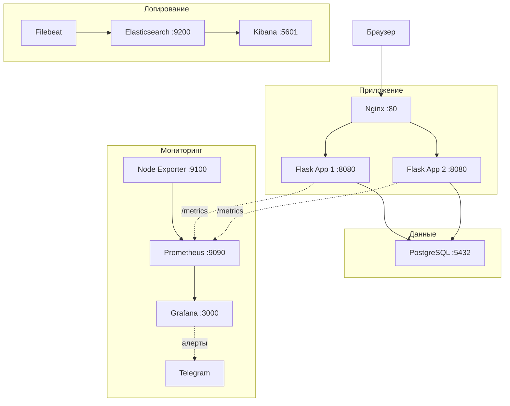

# Infrastructure Blueprint


Инфраструктура для автоматического развертывания отказоустойчивого веб-приложения с балансировкой нагрузки, мониторингом ресурсов, централизованным сбором логов и CI/CD пайплайном.

Проект построен с использованием гипервизора Proxmox VE: в качестве production-сервера выступает виртуальная машина Ubuntu 22.04, а сборка и доставка осуществляются через LXC-контейнер с раннером GitLab.

---

## Архитектура



**Два уровня автоматизации:**
- **Ansible** отвечает за подготовку инфраструктуры хоста: установку Docker, создание общей сети, размещение конфигурационных файлов мониторинга и логирования, а также запуск базового стека.
- **GitLab CI/CD** обеспечивает непрерывную сборку и деплой веб-приложения при каждом коммите в ветку `main`.

Для подробного ознакомления с архитектурой см. файл [architecture.md](file:///D:/infrastructure-blueprint/docs/architecture.md).

---

## Стек технологий

| Категория | Технология | Версия | Назначение |
|-----------|-----------|--------|------------|
| Приложение | Python, Flask | 3.10 | Демонстрационное веб-приложение |
| Балансировка | Nginx | alpine | Распределение трафика (Reverse Proxy) |
| База данных | PostgreSQL | 15 | Хранилище данных веб-приложения |
| Контейнеризация | Docker, Docker Compose | 24.x | Оркестрация локальных контейнеров |
| Автоматизация | Ansible | 2.x | Конфигурирование серверов и IaC |
| CI/CD | GitLab CI | — | Автоматизация сборки и непрерывной доставки |
| Мониторинг | Prometheus, Grafana, Node Exporter | latest | Сбор и визуализация метрик, алертинг |
| Логирование | Elasticsearch, Filebeat, Kibana | 7.17 | Централизованный сбор и анализ логов |
| Гипервизор | Proxmox VE | 8.x | Виртуализация хоста и CI/CD раннера |

---

## Быстрый старт

> Предполагается, что у вас есть настроенный сервер с Ubuntu 22.04 и SSH-доступ к нему по ключу.

**1. Клонируйте репозиторий:**
```bash
git clone https://github.com/booowieee/infrastructure-blueprint.git
cd infrastructure-blueprint
```

**2. Укажите параметры сервера в инвентаре Ansible:**
```bash
nano ansible/inventory/hosts.ini
# Замените <YOUR_SERVER_IP> и <YOUR_USERNAME> на ваши данные
```

**3. Выполните первоначальную настройку хоста (установка Docker, настройка системных параметров):**
```bash
ansible-playbook -i ansible/inventory/hosts.ini ansible/playbooks/setup_server.yml
```

**4. Разверните базовый инфраструктурный стек (БД, мониторинг, ELK):**
```bash
ansible-playbook -i ansible/inventory/hosts.ini ansible/playbooks/deploy_infra.yml
```

После успешного выполнения Ansible-плейбуков приложение будет готово к развертыванию через GitLab CI/CD при пуше изменений.

---

## Подробное описание компонентов

### Ansible: подготовка серверов
*   [setup_server.yml](file:///D:/infrastructure-blueprint/ansible/playbooks/setup_server.yml): Одноразовый плейбук, который устанавливает пакеты Docker Engine, добавляет текущего пользователя в группу `docker`, настраивает параметр `vm.max_map_count` для Elasticsearch и создает общую Docker-сеть `app-network`.
*   [deploy_infra.yml](file:///D:/infrastructure-blueprint/ansible/playbooks/deploy_infra.yml): Копирует файлы настроек, настраивает ежедневное резервное копирование БД в cron и запускает Docker Compose стек инфраструктуры.

### CI/CD: автоматическая доставка
Пайплайн в [.gitlab-ci.yml](file:///D:/infrastructure-blueprint/.gitlab-ci.yml) разделен на 3 стадии:
1.  **`lint`**: Проверяет работоспособность докер-сокета раннера.
2.  **`build`**: Собирает Docker-образ приложения и пушит его в GitLab Container Registry (триггерится только при изменении файлов в `app/`).
3.  **`deploy`**: Подключается к серверу по SSH, копирует конфигурации балансировщика, скачивает новую версию образа и перезапускает веб-приложение без простоя.

### Резервное копирование
Ежедневно в 03:00 cron запускает скрипт [backup.sh](file:///D:/infrastructure-blueprint/ansible/files/backup.sh). Скрипт делает сжатый дамп базы PostgreSQL, сохраняет его в директорию `/var/backups/postgres/` и производит ротацию — удаляет бэкапы старше 3 дней для экономии места.

---

## Трудности и решения

Ниже представлены ключевые технические проблемы, решенные в ходе реализации проекта. Подробный разбор ошибок доступен в файле [troubleshooting.md](file:///D:/infrastructure-blueprint/docs/troubleshooting.md).

<details>
<summary><b>1. Ошибка валидации SSH-ключа на раннере GitLab (invalid format)</b></summary>
При подключении по SSH раннер выдавал ошибку формата ключа. Проблема была решена корректным добавлением переменной типа File в настройках GitLab CI/CD с нажатием клавиши Enter после финальной строки `-----END OPENSSH PRIVATE KEY-----` для записи символа переноса строки.
</details>

<details>
<summary><b>2. Падение Elasticsearch при старте (OOM / bootstrap check)</b></summary>
Elasticsearch требовал более высокого лимита областей виртуальной памяти хоста. Решено добавлением задачи в Ansible-плейбук, изменяющей параметр ядра `vm.max_map_count` на `262144` с перезагрузкой.
</details>

<details>
<summary><b>3. Ошибка отсутствия внешней сети (external network not found)</b></summary>
Контейнеры приложения и базы данных не могли связаться из-за отсутствия общей внешней сети на момент запуска первого Compose файла. Проблема решена созданием внешней сети `app-network` на уровне плейбука Ansible перед запуском любых контейнеров.
</details>

---

## Структура репозитория

```
infrastructure-blueprint/
├── .editorconfig                  # Настройки редактора (LF, отступы 2 пробела)
├── .gitattributes                 # Нормализация окончаний строк
├── .gitignore                     # Исключения Git
├── .gitlab-ci.yml                 # Пайплайн сборки и доставки
├── .env.example                   # Шаблон переменных окружения
├── LICENSE                        # MIT License
├── README.md                      # Документация проекта
├── docker-compose.app.yml         # Compose-файл приложения (Nginx + 2 ноды)
├── app/                           # Исходный код Flask приложения
│   ├── Dockerfile
│   ├── main.py
│   └── requirements.txt
├── nginx/                         # Конфигурация Nginx
│   └── nginx.conf
├── docs/                          # Подробные руководства
│   ├── architecture.md            # Архитектурная документация
│   └── troubleshooting.md         # Описание решенных проблем
└── ansible/                       # Скрипты автоматизации развертывания
    ├── inventory/
    │   └── hosts.ini              # Файл инвентаря
    ├── playbooks/
    │   ├── setup_server.yml       # Подготовка хоста
    │   └── deploy_infra.yml       # Деплой окружения
    └── files/
        ├── docker-compose.infra.yml # Стек мониторинга и логирования
        ├── prometheus.yml          # Настройки Prometheus
        ├── filebeat.yml            # Настройки Filebeat
        └── backup.sh               # Скрипт резервного копирования
```
