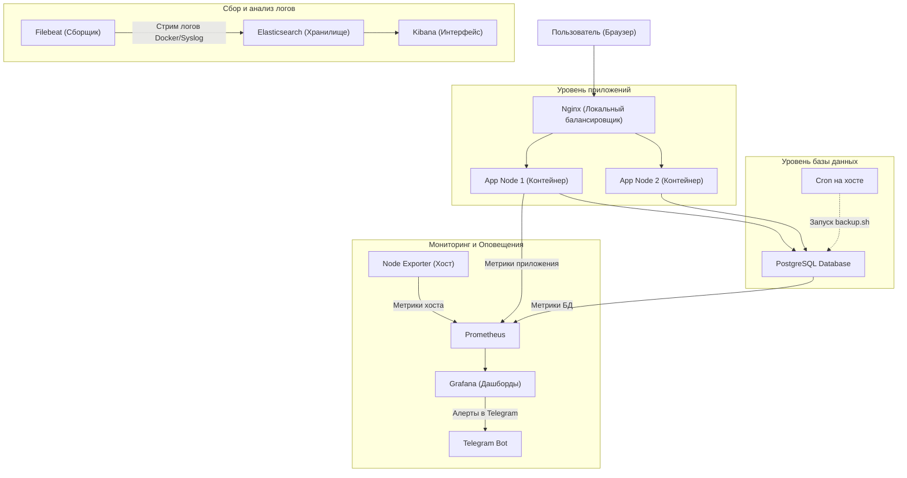

# Архитектура инфраструктуры проекта (Infrastructure Blueprint)

В данном документе описана архитектура и составные части инфраструктуры проекта. Вся конфигурация хранится в репозитории как код (IaC) и развертывается автоматически.

---

## 1. Архитектурная схема (Mermaid Diagram)

---

## 2. Компоненты инфраструктуры

### 2.1 Сетевой балансировщик (Nginx)
*   **Роль**: Входная точка для пользовательского трафика (Reverse Proxy).
*   **Задача**: Распределять входящие HTTP-запросы между двумя экземплярами приложения (`App Node 1` и `App Node 2`) для снижения нагрузки и обеспечения отказоустойчивости (если одна нода упадет, вторая продолжит работу).

### 2.2 Уровень приложений (App Nodes)
*   **Роль**: Два идентичных контейнера с веб-приложением на Flask.
*   **Задача**: Демонстрация горизонтального масштабирования. Приложение настроено на отдачу метрик для Prometheus и логирование в stdout для Filebeat.

### 2.3 База данных (PostgreSQL)
*   **Роль**: Основное хранилище данных.
*   **Задача**: Сохранение состояния приложения. 
*   **Резервное копирование**: Скрипт [backup.sh](../ansible/files/backup.sh) запускается по расписанию через cron на хосте, делает сжатый дамп базы и удаляет старые копии.

### 2.4 Стек мониторинга (Prometheus + Grafana + Node Exporter)
*   **Node Exporter**: Собирает метрики процессора, памяти и диска самого сервера.
*   **Prometheus**: Регулярно опрашивает (scrape) Node Exporter и контейнеры приложений, сохраняя метрики в базу временных рядов (TSDB).
*   **Grafana**: Строит графики на основе данных Prometheus. Настроены правила оповещения, которые при критической нагрузке (например, нехватка места на диске или падение базы) отправляют уведомления в Telegram.

### 2.5 Стек логирования (Filebeat + Elasticsearch + Kibana)
*   **Filebeat**: Легковесный агент, собирающий логи из контейнеров Docker.
*   **Elasticsearch**: База данных для быстрого полнотекстового поиска по логам.
*   **Kibana**: Веб-интерфейс для анализа логов и поиска ошибок.

---

## 3. Процессы автоматизации (IaC & CI/CD)

### 3.1 Подготовка серверов (Ansible)
Для управления инфраструктурой я написал два Ansible-плейбука:
*   [setup_server.yml](../ansible/playbooks/setup_server.yml) — выполняет первоначальную подготовку чистого сервера (устанавливает Docker, настраивает параметры ядра для Elasticsearch, создает общую сеть `app-network`).
*   [deploy_infra.yml](../ansible/playbooks/deploy_infra.yml) — копирует конфигурации и развертывает инфраструктурный стек.

### 3.2 Доставка кода (GitLab CI/CD)
*   При каждом пуше в ветку `main` запускается пайплайн.
*   Пайплайн тестирует код, собирает новый Docker-образ и пушит его в GitLab Container Registry.
*   После этого пайплайн подключается к серверу по SSH и обновляет контейнеры приложения без простоя сервиса.
